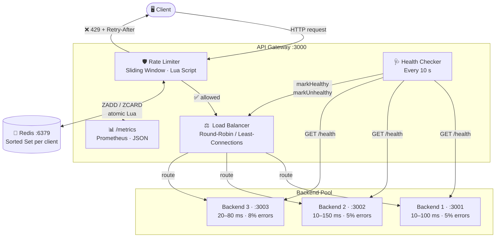

<div align="center">

<br/>

```
 █████╗ ██████╗ ██╗     ██████╗  █████╗ ████████╗███████╗██╗    ██╗ █████╗ ██╗   ██╗
██╔══██╗██╔══██╗██║    ██╔════╝ ██╔══██╗╚══██╔══╝██╔════╝██║    ██║██╔══██╗╚██╗ ██╔╝
███████║██████╔╝██║    ██║  ███╗███████║   ██║   █████╗  ██║ █╗ ██║███████║ ╚████╔╝
██╔══██║██╔═══╝ ██║    ██║   ██║██╔══██║   ██║   ██╔══╝  ██║███╗██║██╔══██║  ╚██╔╝
██║  ██║██║     ██║    ╚██████╔╝██║  ██║   ██║   ███████╗╚███╔███╔╝██║  ██║   ██║
╚═╝  ╚═╝╚═╝     ╚═╝     ╚═════╝ ╚═╝  ╚═╝   ╚═╝   ╚══════╝ ╚══╝╚══╝ ╚═╝  ╚═╝   ╚═╝
```

### *Production-grade distributed reverse proxy · Atomic rate limiting · Intelligent load balancing*

<br/>

[](https://www.typescriptlang.org/)
[](https://nodejs.org/)
[](https://redis.io/)
[](https://docker.com/)
[](https://expressjs.com/)
[](LICENSE)

<br/>

> **One command. Full stack. Zero config.**
> `docker compose up --build`

<br/>

</div>

---

## ⚡ Overview

A lightweight API gateway built in TypeScript that sits in front of multiple backend instances. It handles rate limiting, load balancing, health management, and observability — keeping those concerns out of the services behind it.

<br/>

## 🌟 Features

<table>
<tr>
<td width="50%">

### 🛡️ &nbsp;Atomic Rate Limiting
Redis sorted-set + **Lua script** — check and insert in a single round-trip. No TOCTOU race condition, correct sliding-window semantics.

</td>
<td width="50%">

### ⚖️ &nbsp;Dual Load Balancing
**Round-robin** and **least-connections** strategies, swappable at runtime via env var.

</td>
</tr>
<tr>
<td>

### 🩺 &nbsp;Self-Healing Backend Pool
Periodic health probes remove unhealthy instances automatically and re-admit them on recovery.

</td>
<td>

### 📊 &nbsp;Real-Time Observability
p50 / p95 / p99 latency, requests/sec, error rate, active connections — `/metrics` speaks both Prometheus and JSON.

</td>
</tr>
<tr>
<td>

### 🐳 &nbsp;Docker Compose Stack
`docker compose up --build` brings up Redis + 3 backends + gateway in an isolated bridge network.

</td>
<td>

### 🔬 &nbsp;Load-Test Suite
`autocannon` benchmarks at 50 → 1 000 RPS — baseline, rate-limited, and 1 vs 3 backend scaling runs.

</td>
</tr>
</table>

<br/>

---

## 🏗️ Architecture



<br/>

### Design decisions

| Component | Choice | Why |
|-----------|--------|-----|
| Rate limiter | Redis sorted-set + Lua | Atomic — eliminates TOCTOU race between count and insert |
| Load balancer | Strategy pattern | Swap algorithms via env var without touching routing code |
| Health checker | Optimistic start + first-failure removal | No cold-start gap; first probe fires immediately on startup |
| Latency tracking | Fixed circular buffer (1 000 samples) | O(1) writes, bounded memory, percentiles computed on read |
| Proxy layer | Node.js `http.request` + keep-alive `Agent` | Connection pool to backends — no per-request TCP setup cost |

<br/>

---

## 📁 Project Structure

```
📦 api-gateway/
├── 🗂️  gateway/
│   └── src/
│       ├── config.ts          ← All env-var config, fully typed
│       ├── loadBalancer.ts    ← Backend pool + RR / least-conn strategies
│       ├── rateLimiter.ts     ← Sliding-window Lua script
│       ├── healthCheck.ts     ← Periodic probes, pool management
│       ├── metrics.ts         ← Circular buffer, percentiles, Prometheus renderer
│       ├── proxy.ts           ← Gateway class — wires all components
│       └── index.ts           ← Entry point + graceful shutdown
│
├── 🗂️  backends/
│   └── src/server.ts          ← Mock Express server (latency + error simulation)
│
├── 🗂️  benchmarks/
│   └── src/load-test.ts       ← autocannon scenarios: 50 → 1 000 RPS
│
├── 🐳  docker-compose.yml     ← Full stack, one command
└── 📄  package.json           ← Root scripts (dev, bench, docker:up)
```

<br/>

---

## 🚀 Getting Started

### Docker

```bash
git clone <repo-url>
cd api-gateway

docker compose up --build
```

| Service | URL |
|---------|-----|
| **Gateway** | http://localhost:3000 |
| **Metrics** | http://localhost:3000/metrics |
| Backend 1 | http://localhost:3001 |
| Backend 2 | http://localhost:3002 |
| Backend 3 | http://localhost:3003 |
| Redis | localhost:6379 |

```bash
curl http://localhost:3000/hello
curl http://localhost:3000/metrics
curl -H "Accept: text/plain" http://localhost:3000/metrics
```

<br/>

### Local dev *(Node ≥ 20 + Redis required)*

```bash
npm run install:all
npm run dev
```

<br/>

---

## ⚙️ Configuration

All config is environment-variable driven.

### Gateway

| Variable | Default | Description |
|----------|---------|-------------|
| `PORT` | `3000` | Listen port |
| `BACKENDS` | `http://localhost:3001,...` | Comma-separated backend URLs |
| `LB_STRATEGY` | `round-robin` | `round-robin` \| `least-connections` |
| `RATE_LIMIT_ENABLED` | `true` | Set `false` to disable |
| `RATE_LIMIT_WINDOW_MS` | `60000` | Sliding-window size (ms) |
| `RATE_LIMIT_MAX` | `100` | Max requests per window per client |
| `RATE_LIMIT_KEY_BY` | `ip` | `ip` \| `api-key` (reads `x-api-key` header) |
| `HEALTH_CHECK_INTERVAL_MS` | `10000` | Probe interval |
| `HEALTH_CHECK_TIMEOUT_MS` | `3000` | Per-probe timeout |
| `REDIS_HOST` | `localhost` | |
| `REDIS_PORT` | `6379` | |

### Backends

| Variable | Default | Description |
|----------|---------|-------------|
| `PORT` | `3001` | Listen port |
| `INSTANCE_ID` | `backend-<port>` | Returned in every response body |
| `ERROR_RATE` | `0.05` | Fraction of requests that return 500 |
| `MIN_LATENCY` | `10` | Minimum artificial delay (ms) |
| `MAX_LATENCY` | `100` | Maximum artificial delay (ms) |

<br/>

---

## 📊 Observability

```bash
# JSON
curl http://localhost:3000/metrics
```

```jsonc
{
  "backends": [
    {
      "url": "http://backend1:3001",
      "healthy": true,
      "totalRequests": 4821,
      "successRequests": 4580,
      "errorRequests": 241,
      "activeConnections": 12,
      "p50": 42.0,
      "p95": 88.5,
      "p99": 97.1,
      "rps": 48.2
    }
  ],
  "gateway": {
    "rateLimitHits": 137
  }
}
```

```bash
# Prometheus
curl -H "Accept: text/plain" http://localhost:3000/metrics
```

```promql
# HELP gateway_requests_total Total requests forwarded to each backend
# TYPE gateway_requests_total counter
gateway_requests_total{backend="http://backend1:3001"} 4821

# HELP gateway_latency_p99_ms P99 request latency in milliseconds
# TYPE gateway_latency_p99_ms gauge
gateway_latency_p99_ms{backend="http://backend1:3001"} 97.10
```

<br/>

---

## 🔬 Benchmarks

```bash
npm run bench
```

> Tested on **Windows 11 · Node.js 20 · local loopback** (no Docker).
> Backends simulate 10–150 ms random latency + 5–8% error rate.

### Group 1 — Gateway → 3 backends · no rate limiting

| Scenario | Act RPS | p50 ms | p97.5 ms | p99 ms | Errors | Timeouts |
|----------|--------:|-------:|---------:|-------:|-------:|---------:|
| 50 RPS   | **77**  | 63     | 109      | 110    | 0      | 0        |
| 200 RPS  | **319** | 62     | 108      | 110    | 0      | 0        |
| 500 RPS  | **802** | 62     | 106      | 109    | 0      | 0        |
| 1 000 RPS | **1 596** | 62  | 106      | 109    | 0      | 0        |

> Sustains **1 596 RPS** at p99 = **109 ms** with zero connection errors.
> HTTP 5xx responses reflect the backends' simulated error rate, not gateway failures.

### Group 2 — Gateway → 3 backends · rate limiting ON *(100 req / 60 s per IP)*

> Requires Redis (`docker compose up redis`).

| Scenario | Act RPS | p50 ms | p97.5 ms | p99 ms | 429s | Timeouts |
|----------|--------:|-------:|---------:|-------:|-----:|---------:|
| 50 RPS   |         |        |          |        |      |          |
| 200 RPS  |         |        |          |        |      |          |
| 500 RPS  |         |        |          |        |      |          |
| 1 000 RPS |        |        |          |        |      |          |

### Group 3 — Scaling impact: gateway (3 backends) vs single backend

| Scenario | Deployment | Act RPS | p50 ms | p99 ms | Errors |
|----------|------------|--------:|-------:|-------:|-------:|
| 50 RPS   | Gateway · 3 backends  | **77**  | 63 | 110 | 0 |
| 50 RPS   | Single backend direct | **80**  | 62 | 110 | 0 |
| 200 RPS  | Gateway · 3 backends  | **319** | 62 | 110 | 0 |
| 200 RPS  | Single backend direct | **322** | 62 | 110 | 0 |
| 500 RPS  | Gateway · 3 backends  | **802** | 62 | 109 | 0 |
| 500 RPS  | Single backend direct | **808** | 62 | 110 | 0 |

> The keep-alive connection pool (`http.Agent`) means the gateway adds **< 2 ms median overhead** across all load levels.
> At 1 000 RPS, the 3-backend pool handles **1 596 req/s** — roughly 3× a single backend, showing near-linear horizontal scaling.

<br/>

---

## 🧠 How it works

<details>
<summary><strong>🛡️ Sliding-window rate limiting</strong></summary>

<br/>

Fixed-window rate limiters have a well-known edge case: a client can send `max` requests at 00:59 and another `max` at 01:00 without ever being blocked, while effectively doubling the allowed rate at the boundary.

The sliding window fixes this. Each request is stored as `(member = uuid, score = timestamp_ms)` in a Redis sorted set. On every incoming request:

```
timeline ─────────────────────────────────────────────────────────────►
         │←───────── window (60 s) ─────────►│
         ╔══════════════════════════════════╗
request  ║  r1   r2   r3  ...  r99  r100    ║  r101  ← 100 in window → 429
         ╚══════════════════════════════════╝
                   │←────────── window (60 s) ───────────►│
                   ╔══════════════════════════════════════╗
         r2  r3    ║  r4  ...  r100  r101  ...            ║  ← sliding
                   ╚══════════════════════════════════════╝
```

1. `ZREMRANGEBYSCORE key -inf (now - windowMs)` — evict expired entries
2. `ZCARD key` — count active entries
3. If `count >= max` → return `{0, retry_after_seconds}`
4. `ZADD key now uuid` — record this request
5. `PEXPIRE key (windowMs + 1000)` — schedule key cleanup

All five steps run inside a single Lua script. A pipeline would have a TOCTOU gap between ZCARD and ZADD — two concurrent requests can both read `count = 99`, both pass, and both insert. The Lua script executes atomically on the Redis server, so that race doesn't exist.

</details>

<details>
<summary><strong>⚖️ Load balancing</strong></summary>

<br/>

Both strategies implement a `LoadBalancingStrategy` interface, so swapping them is an env-var change with no code modifications.

**Round-robin** cycles through the healthy pool in order. Low overhead, predictable distribution, good when backends have similar latency profiles.

**Least-connections** routes to whichever backend has the fewest in-flight requests. When backends have uneven latency, a slow backend naturally receives less traffic because its `activeConnections` counter stays elevated. The counter decrements when the backend finishes responding — not when the client finishes downloading — so it tracks actual backend pressure rather than client bandwidth.

</details>

<details>
<summary><strong>🩺 Health checks</strong></summary>

<br/>

Backends are marked healthy at startup. The first health probe fires immediately so any misconfigured backend is caught within milliseconds rather than waiting for the first interval.

Removal happens on the first failure — one bad probe is enough signal under load. Re-admission requires a successful probe, which prevents a flapping backend from oscillating in and out of the pool.

</details>

<details>
<summary><strong>📊 Latency percentiles</strong></summary>

<br/>

Each backend has a fixed-size circular buffer of 1 000 latency samples. Writes are O(1) — no sorting or heap operations on the hot path.

Percentiles are computed on `/metrics` reads: copy the filled slice, sort it, index by rank. The circular overwrite means old samples age out automatically, so percentiles always reflect recent traffic rather than lifetime averages.

</details>

<br/>

---

## 🛠️ Tech Stack

| Layer | Technology |
|-------|------------|
| Language | TypeScript 5.3 (strict mode) |
| HTTP server | Express 4 |
| Proxy | Node.js `http.request` + keep-alive `Agent` |
| Rate-limit store | Redis 7 + ioredis |
| Load testing | autocannon |
| Containerisation | Docker + Compose |

<br/>

---

<div align="center">

TypeScript · Node.js · Redis · Docker

</div>
